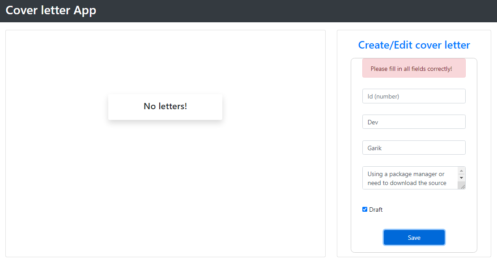
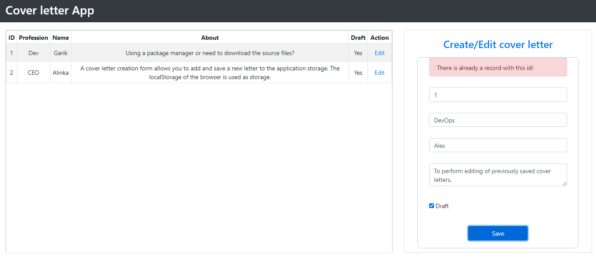
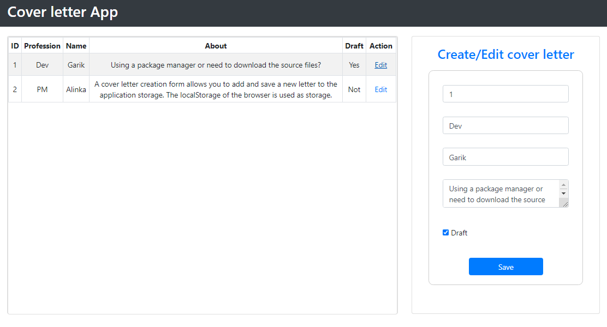
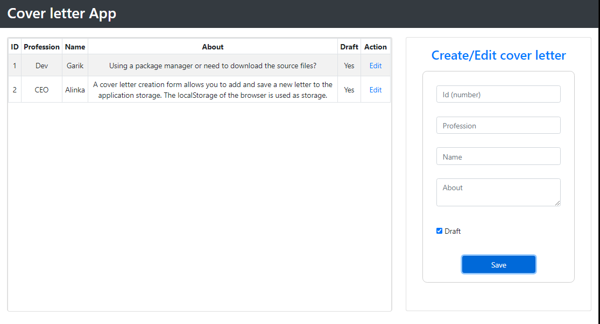
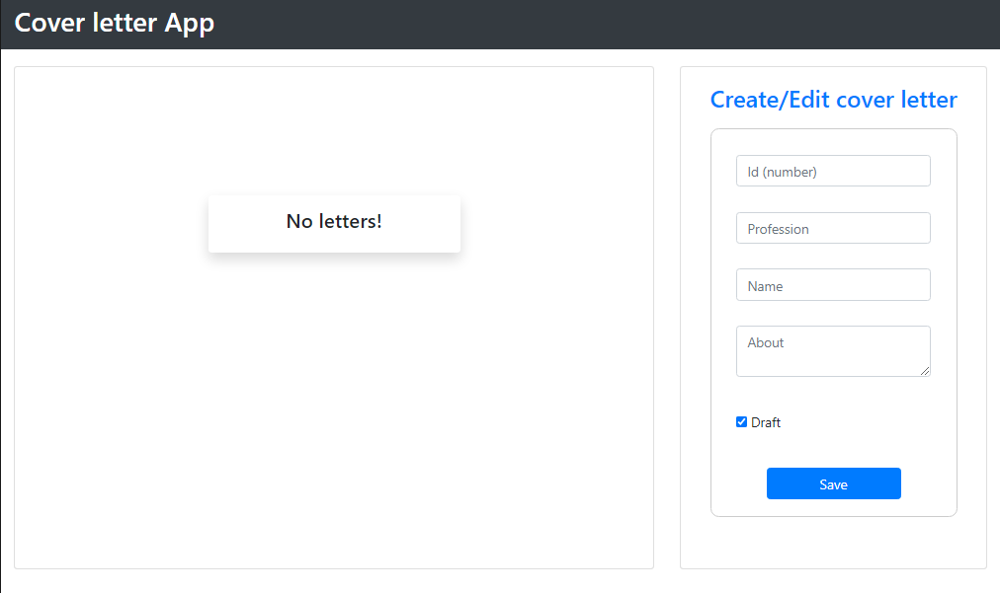

# CoverLetter
CoverLetter App (Angular + Bootstrap)


## Created with
- Node.js
- Angilar 10.0
- Bootstrap 4.5

## Clone
- Clone this repo to your local machine using 
- Install dependency packages
``` 
https://github.com/IgorNazaryok/CoverLetter
```

## Features
- Create a new cover letter
- Editing a cover letter
- View to display a list of saved cover letters
---

- ### Create cover letter
A cover letter creation form allows you to add and save a new letter to the application storage. The localStorage of the browser is used as storage. The form is validated for the mandatory filling of all fields, as well as for the uniqueness of the ID in the database when creating a letter. <br>

 <br>
 <br>
 <br>

<br> 


- ### Edit cover letter
To perform editing of previously saved cover letters, the form for creating a letter is used. Added a check to prohibit editing the id field for letters for which the draft flag is false. <br>
<br>
<br>
<br>
<br> 

<br> 

- ### View viewing the saved list of letters

The list of letters is sorted and displayed in ascending order by ID.
If there are no previously saved letters, the messages - 'No letters!' <br>

 <br>
<br> 


<br>

>### Contact Information
 ***Nazaryok Igor*** <br>
> e-mail: igor.nazarek@gmail.com <br>
Linkedin: http://www.linkedin.com/in/igor-nazaryok
